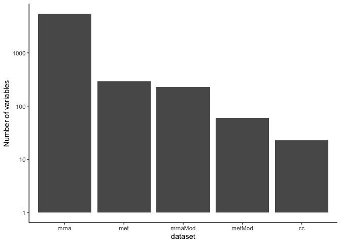

## Steps to reproduce asthma datasets

* download the [asthma datasets](https://github.com/singha53/diablo_datasets/blob/master/asthma/asthmaDatasets.RDATA)
* summarise probe level mRNA data gene level data


```r
load(here::here("dataCleaning", "asthma", "data", "asthmaDatasets.RDATA"))

## summary affy probe sets to gene symbols (average probes with the same gene symbol)
eset0 <- genDat[, -ncol(genDat)] %>% 
  mutate(genSym = getSYMBOL(rownames(.), "hugene10sttranscriptcluster")) %>% 
  filter(!is.na(genSym)) %>% group_by(genSym) %>% 
  summarise_all(funs(mean))
eset <- as.matrix(eset0[,-1])
rownames(eset) <- as.character(eset0$genSym)

asthma <- list(demo = demo,
               cc = cells,
               mrna = t(eset),
               met = t(metExp),
               metAnn = metabolites,
               mrnaMod = gene.module,
               metMod = metabolite.module)
```

## Data summary

### study design


```r
with(asthma$demo, table(Time, Response))
```

```
##       Response
## Time   DR ER
##   post  6  8
##   pre   6  8
```


### number of variables of each data-type
* dataypes include:
  - cell-type frequencies (cc)
  - gene expression (mrna)
  - metabolite expression (met)
  - gene modules (gene expression [summarised](https://github.com/singha53/diablo_datasets/blob/master/asthma/asthmaDatasets.R) to pathway level data)
  - metabolite modules (metabolite expression [summarised](https://github.com/singha53/diablo_datasets/blob/master/asthma/asthmaDatasets.R) to pathway level data)


```r
dataTypes <- c("cc", "mrna", "met", "mrnaMod", "metMod")
data.frame(dataTypes = dataTypes,
  size = sapply(asthma, ncol)[dataTypes]) %>% 
  ggplot(aes(x = reorder(dataTypes, -size), y = size)) +
  geom_bar(stat = "identity") +
  scale_y_log10() +
  ylab("Number of variables") +
  xlab("dataset") +
  theme_classic()
```

<!-- -->


## Save package data


```r
usethis::use_data(asthma, overwrite = TRUE)
```

```
## ✔ Setting active project to '/Users/asingh/Documents/omics-central-packages/r/omicsCentralDatasets'
## ✔ Saving 'asthma' to 'data/asthma.rda'
```

